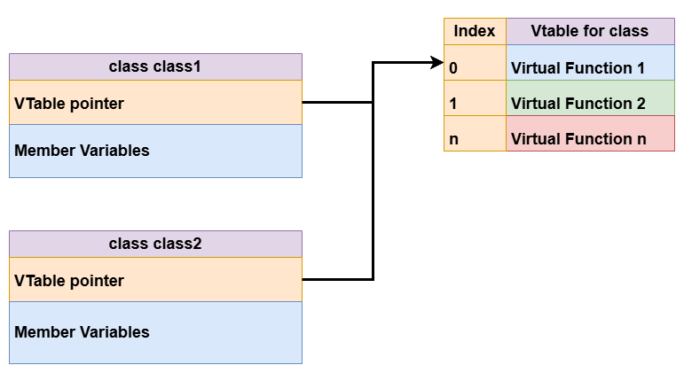
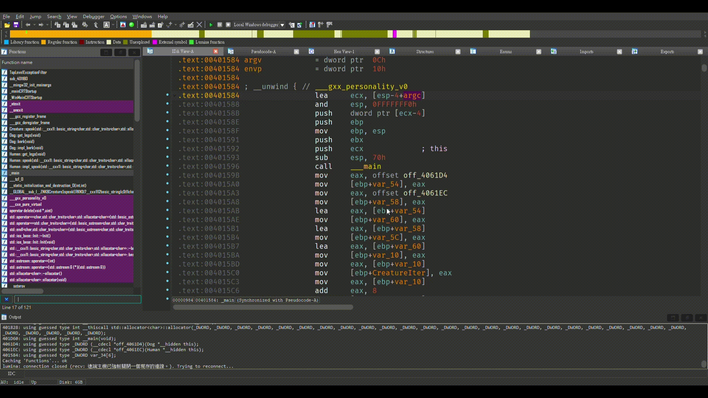

# Virtual Table
很多人接觸遊戲外掛撰寫時可能常常聽到 Vtable ，即 Virtual Table。 至於它到底是甚麼，下面就來簡單解說一下。

C++ OOP 功能裡面包含一個功能，即虛擬函數。其允許衍伸類別自定義或覆寫基礎類別的函數。聽起來可能有些深奧，

下面舉個例子:

```c++
class Creature {
public:
    virtual int get_legs() const = 0;

    virtual void speak(const std::string& message) const {
        std::cout << "Creature cannot speak." << std::endl;
    }
};

class Dog : public Creature {
public:
    int get_legs() const override { return 4; }
    void bark() { impl_bark(); }
    
private:
    void impl_bark() const {
        std::cout << "Woof! Woof!" << std::endl;
    }
};

class Human : public Creature {
public:
    int get_legs() const override { return 2; }

    void speak(const std::string& message) const override {
        std::cout << "Human says: " << message << std::endl;
    }
};
```
其中，```Creature``` 是基礎類別，而 ```Dog``` 和 ```Human``` 則是 ```Creature``` 的衍伸類別。

先來看基礎類別 ```Creature``` :
```c++
class Creature {
public:
    virtual int get_legs() const = 0;
    
    virtual ~Creature() = default;
    
    virtual void speak(const std::string& message) const {
        std::cout << "Creature cannot speak." << std::endl;
    }
};
```
第一個函式 ```get_legs``` 是所謂的"純虛擬函式"，即，其衍伸型別**必須**自行定義其函數內容。

因此，可以看到 ```Dog``` 以及 ```Human``` 類別都自行定義了 ```get_legs()```:
```c++
class Dog : public Creature {
public:
    int get_legs() const override { return 4; }
}

class Human : public Creature {
public:
    int get_legs() const override { return 2; }
}
```
可以看到，兩者的 ```get_legs()``` 實作並不一樣，這也是虛擬函數的用處，其允許衍伸型別自行定義虛擬函數。

再來看 ```Creature``` 的第二個函數 ```speak()``` 其包含了預設實做 (default implementation):
```c++
virtual void speak(const std::string& message) const {
    std::cout << "Creature cannot speak." << std::endl;
}
```

若衍伸型別沒有**覆寫** ```speak()``` 函數，則它會在呼叫時印出 ```Creature cannot speak.```

如 ```Dog``` 類別。反之，則執行覆寫函數的內容，如呼叫 ```Human``` 的 ```speak()``` 會印出 ```Human says: <message>```

在介紹完虛擬函數的主要功能後，我們來看一下編譯器是如何實做虛擬函數的。

### Virtual Table (Internal)

當一個延伸類別實作基礎類別時，編譯器會為其建立 ```virtual table thunk```，其包含了所有衍伸類別的虛擬函數位址，

**即虛擬函數表 (virtual table)**。 以剛剛的例子來說，最後的 ```virtual table thunk``` 在記憶體佈局可能如下:


而擁有 Virtual Table 的類別則會於其起始位置建立一個 Vtable Pointer 來連結虛擬表，如有一個類別```class```，其有一個虛擬表，

其記憶體布局如下

(記憶體位址上到下由小到大排列)



(p.s. 排列方式可能因編譯器不同而有所差異)

假設程式碼使用了 Dog 和 Human:
```c++
int main(){
    Dog dog;
    Human human;

    Creature* creatures[] = { &dog, &human };
    
    for (Creature* creature : creatures) {
        std::cout << "Creature has " << creature->get_legs() << " legs." << std::endl;
        creature->speak("Hello!"); 
    }

    dog.bark();
    human.speak("Hello, world!");

    return 0;
}
```

## Fetching Virtual Table
回到正題，我們可以在 IDA 中由衍伸型別的 virtual function 找到其 Virtual Table，方法如下 :

1. 找到類別中任意一個 virtual function (以```Human```中的```speak```函數為例):

2. 定位到函數的開始位址，然後在IDA中用 ```Ctrl + X``` 或 ```View``` -> ```Open Subviews``` -> ```Cross References``` 來做交叉引用(Cross Reference)的查詢。
3. 在列表中，其中一筆結果會包含 ```dx_offset...```(x 可為 d, q，分別代表32位元指標和64位元)， 選取並定位到其位址。

4. 向上尋找，直到你看到 ```off_...```，其即為 Vtable 的起始位址



之後，我們可以看到兩個衍伸類別的 Virtual Function Thunk 布局:
#### class Dog
```c++
.rdata:004061D4 off_4061D4      dd offset __ZNK3Dog8get_legsEv
.rdata:004061D4                                         ; DATA XREF: _main+17↑o
.rdata:004061D4                                         ; Dog::~Dog()+9↑o
.rdata:004061D4                                         ; Dog::get_legs(void)
.rdata:004061D8                 dd offset __ZN3DogD1Ev  ; Dog::~Dog()
.rdata:004061DC                 dd offset __ZN3DogD0Ev  ; Dog::~Dog()
.rdata:004061E0                 dd offset __ZNK8Creature5speakERKNSt7__cxx1112basic_stringIcSt11char_traitsIcESaIcEEE ; Creature::speak(std::__cxx11::basic_string<char,std::char_traits<char>,std::allocator<char>> const&)
```

#### class Human
```c++
.rdata:004061EC off_4061EC      dd offset __ZNK5Human8get_legsEv
.rdata:004061EC                                         ; DATA XREF: _main+1F↑o
.rdata:004061EC                                         ; Human::~Human()+9↑o
.rdata:004061EC                                         ; Human::get_legs(void)
.rdata:004061F0                 dd offset __ZN5HumanD1Ev ; Human::~Human()
.rdata:004061F4                 dd offset __ZN5HumanD0Ev ; Human::~Human()
.rdata:004061F8                 dd offset __ZNK5Human5speakERKNSt7__cxx1112basic_stringIcSt11char_traitsIcESaIcEEE ; Human::speak(std::__cxx11::basic_string<char,std::char_traits<char>,std::allocator<char>> const&)


```
接下來我們來看經由 g++ (C++11) 32 位元編譯後 IDA 產生的偽代碼

首先原代碼中的 ```get_legs``` 呼叫:
 ```c++ 
 creature->get_legs();
 ```
 以及其相對應的偽代碼:
 ```c++
 (**(int (__fastcall ***)(int))pCreature)(pCreature);
 ```
 
 ```(int (__fastcall ***)(int))```是一個函數指標的型別宣告。
 
這段偽代碼的解讀如下：

```pCreature``` 被轉型為一個類別的指標。

接著，我們解引用這個指標，得到虛擬表中第一項 ( 索引值 0 ) 的函數地址。

最後，我們呼叫這個函數，並將 ```pCreature``` 作為參數```this```給它。

由上述解析，可以推斷出函數的原型應該是 ```int some_func(void*)```。由於 IDA 無法準確判斷型別，它將第一個參數 this 的32位元指標視為一個 int 型別的參數，如果不清楚呼叫慣例或不知道為甚麼第一個參數是 this 的可以看[這篇貼文](./addi1.md)。

再來看 ``` creature->speak("Hello!");```
 
其相對應的偽代碼:
 
 ```c++
 v7 = *(void (__thiscall **)(int *, int *, int))(*pCreature + 12);
 std::__cxx11::basic_string<char,std::char_traits<char>,std::allocator<char>>::basic_string(
      &v26,
      "Hello!",
      (char *)&v32 + 3); //std::string str = "Hello";
 v7(pCreature, &v26);
 ```
 首先，由 ```*pCreature``` 取得虛擬表的起始位址。
 
 接著加入偏移值 12，我們可以將其轉換為索引值，由於這是32位元的執行檔，所以指標大小為 4 個 byte，12 / 4 = 3
 所以索引值是 3，所以呼叫 ```speak```，而則為指向一個```std::string```物件的指標。